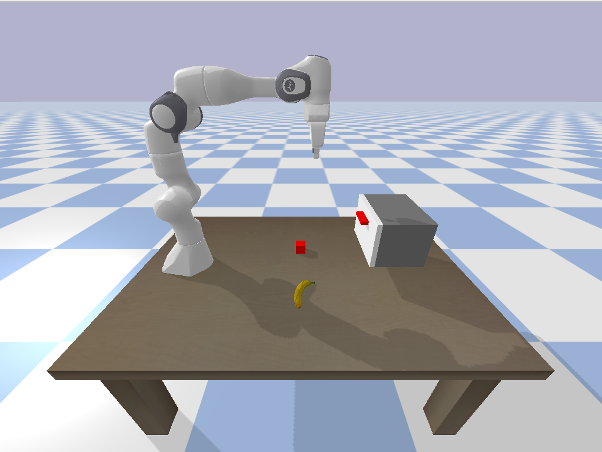

# panda-objects
a minimal implementation of ycb and interactive objects

## Install and Run

```bash

# Download
git clone https://github.com/panda-sim/panda-objects.git
cd panda-objects

# Create and source virtual environment
python3 -m venv venv
source venv/bin/activate

# Install dependencies
pip install numpy pybullet

# Run the script
python main.py
```

## Expected Output

